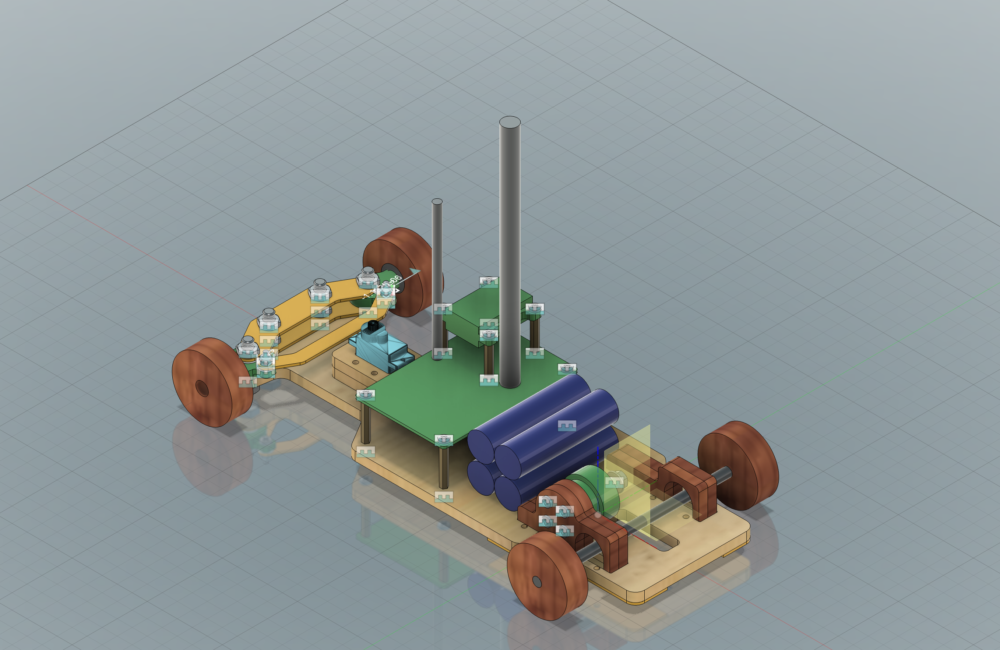
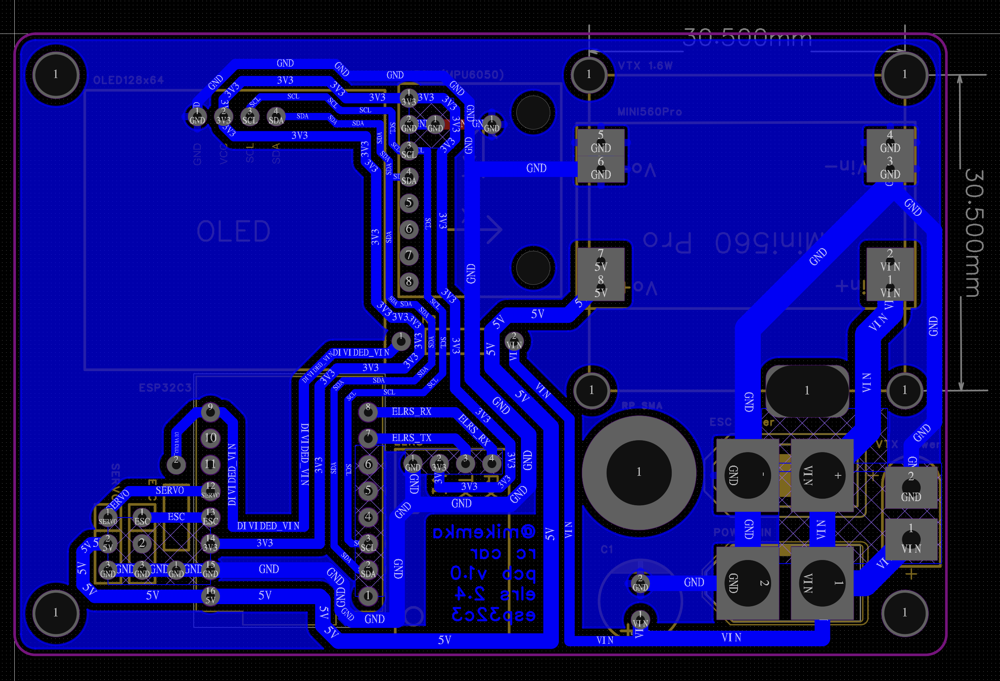
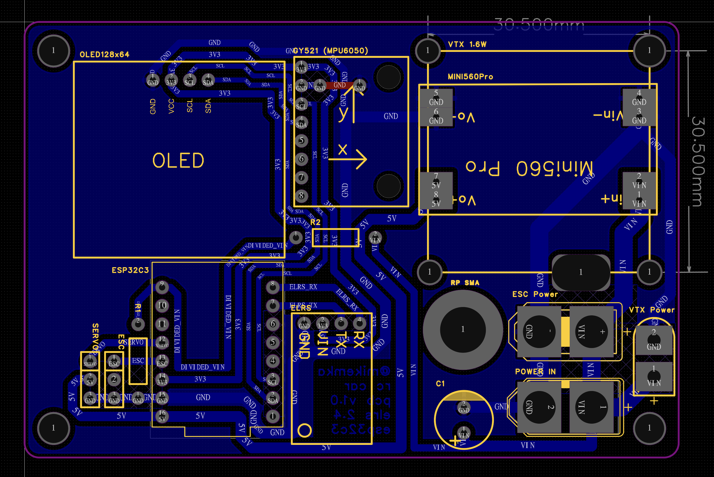

# 🏎️ Drift RC Car

A compact drift RC car project based on **ESP32-C3**, using **ELRS 2.4 GHz** for control and an **analog FPV system with a 1.6 W video transmitter**.

The project combines **firmware**, **custom PCB**, and **mechanical design** into a single, self-contained platform.

Source code is located in the `src/` directory.

---

## ✨ Overview

This project was designed as an experiment in building a fully custom RC platform:

- Custom electronics
- Custom firmware
- Custom mechanical parts
- FPV-first driving experience
- Drifting stabilization

---

## 🧠 Firmware

The firmware runs on **ESP32-C3** and is built with **PlatformIO (Arduino framework)**.

Main features:
- ELRS (CRSF) receiver support
- Servo steering and ESC control
- Gyro-assisted yaw stabilization
- Basic telemetry
- Optional OLED status display

The code is modular, easy to extend, and intended for real-time control.

---

## 🧩 Electronics (PCB)

Repo contains custom one-layer PCB.

It integrates:
- ESP32-C3
- ELRS receiver interface
- Power distribution
- Motor and servo control
- Sensor and peripheral connections

---

## 🏁 Mechanical Design

The chassis and all mechanical parts are fully custom-designed.

- All parts are intended for **CNC milling**
- No 3D printing required
- Designed for easy assembly and maintenance
- Compact layout optimized for drifting

The full mechanical design is available as a Fusion 360 project.

---

## 🖼️ Final Assembly

---

## 🧾 PCB Layout

### PCB Routing — View 1

### PCB Routing — View 2

### PCB Schematic

---

## 📦 Downloads

- 🧾 **PCB manufacturing files (Gerber)**  
  👉 [Download gerber.zip](assets/gerber.zip)

- 🧱 **Complete mechanical design (Fusion 360)**  
  👉 [Download car.f3d](assets/car.f3d)

---

## 📜 License

Open-source / maker-friendly.  
Feel free to use, modify, and build upon this project.

@mikemka, 2026